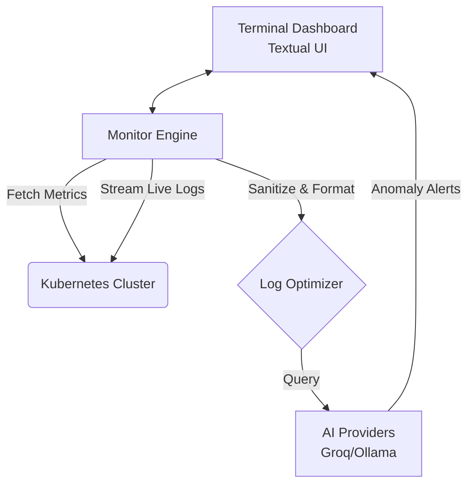

<div align="center">
  <h1>KubeSense</h1>
  <strong>The high-density, terminal-based Kubernetes monitoring dashboard.</strong>
  <br/><br/>
  
  [](https://python.org)
  [](https://kubernetes.io)
  [](LICENSE)
  
  <br/>
  
  
</div>

<hr/>

**KubeSense** is an advanced, terminal-based User Interface (TUI) tool specifically designed for real-time Kubernetes pod monitoring. By leveraging the official Kubernetes Python API and the Textual framework, KubeSense delivers a high-density, system-monitor style dashboard directly to your command line. 

Say goodbye to complex web interfaces. Instantly visualize cluster health, track dynamic CPU and memory usage, tail container logs, and run passive AI-driven log anomaly detection—all from the comfort of your terminal.

## 🏗️ Architecture Overview



For a deeper dive into how KubeSense works under the hood, check out the [Detailed Architecture Guide](docs/ARCHITECTURE.md).

## ✨ Key Features

- 📊 **Real-time Metrics**: High-density system-monitor style dashboard for CPU and memory usage.
- 📜 **Live Log Tailing**: Stream container logs instantly without leaving the UI.
- 🤖 **AI-Powered Insights**: Passive AI-driven log anomaly detection to spot issues before they escalate.
- 🚀 **Zero Overhead**: No heavy web UI. Pure terminal application powered by Textual.
- 🔌 **Seamless Integration**: Connects via your existing `kubectl` context, with a fallback SSH connection for node-level metrics.

---

## 🚀 Quick Start

### Prerequisites
- Python 3.10+
- A locally configured `kubectl` context to authenticate with your Kubernetes cluster (e.g., Minikube).

### Installation

1. **Clone the repository:**
   ```bash
   git clone https://github.com/Joydeep2005Banik/pod_monitor.git
   cd pod_monitor
   ```

2. **Set up a virtual environment:**
   ```bash
   python3 -m venv venv
   source venv/bin/activate
   ```

3. **Install dependencies:**
   ```bash
   pip install -r requirements.txt
   ```

---

## ⚙️ Configuration & Usage

### 1. Prepare Your Cluster
Ensure you have an active Kubernetes cluster. For local testing, you can deploy a lightweight cluster using Minikube:
```bash
minikube start
```

### 2. Configure KubeSense
Customize application behaviors in `config.yaml`. KubeSense connects to your cluster primarily via your local Kubernetes context, but supports a direct SSH fallback mechanism for retrieving node-level metrics if API metrics fail.

<details>
<summary><strong>Click to view example <code>config.yaml</code></strong></summary>

```yaml
# SSH Connection Settings (Fallback)
ssh:
  host: "192.168.49.2"
  user: "docker"
  password: ""
  key_path: "~/.minikube/machines/minikube/id_rsa"
  port: 22
  timeout: 30

monitor:
  # Mode defines the primary connection type
  mode: "kubectl"
  
  # Kubernetes context to use (must match a context in your ~/.kube/config)
  context: "minikube"
  
  namespaces:
    - "default"
  refresh_interval: 5
  log_lines_to_fetch: 50
  anomaly_threshold: 3
```
</details>

### 3. Deploy Test Workloads (Optional)
KubeSense requires active pods in your cluster to monitor. You can deploy your own workloads or use the provided test configuration, which includes healthy, crashing, and high-load pods to test the UI limits.

```bash
kubectl apply -f tests/test-pod.yaml
```

### 4. Launch the Dashboard
With your cluster running and virtual environment active, start KubeSense:
```bash
python -m pod_monitor
```

---

## 🎮 Interface Controls

| Key / Action | Description |
| :--- | :--- |
| **⬆️ / ⬇️** or **Click** | Select a specific pod from the sidebar to inspect its detailed metrics and live logs. |
| **R** | Manually refresh the data feed for the current view. |
| **A** | Toggle the AI-powered log analysis module. |
| **S** | Capture and save an SVG screenshot of the current interface. |
| **Q** | Terminate the application safely. |

---

## 📸 Screenshots

<div align="center">
  
  
  <p><em>Experience a high-density visual summary of your infrastructure without leaving the command line.</em></p>
</div>

---

## 🚧 Upcoming Features
- 🔧 **Environment Variable Configuration**: Robust support for passing configurations via Environment Variables, deprecating strict reliance on local YAML files and simplifying deployment in CI/CD pipelines.

---
