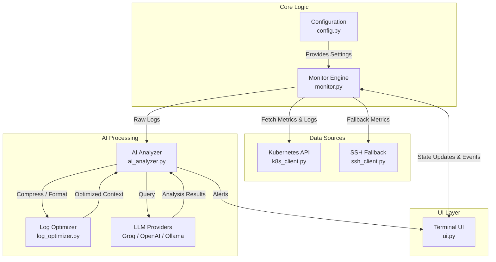
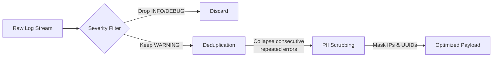
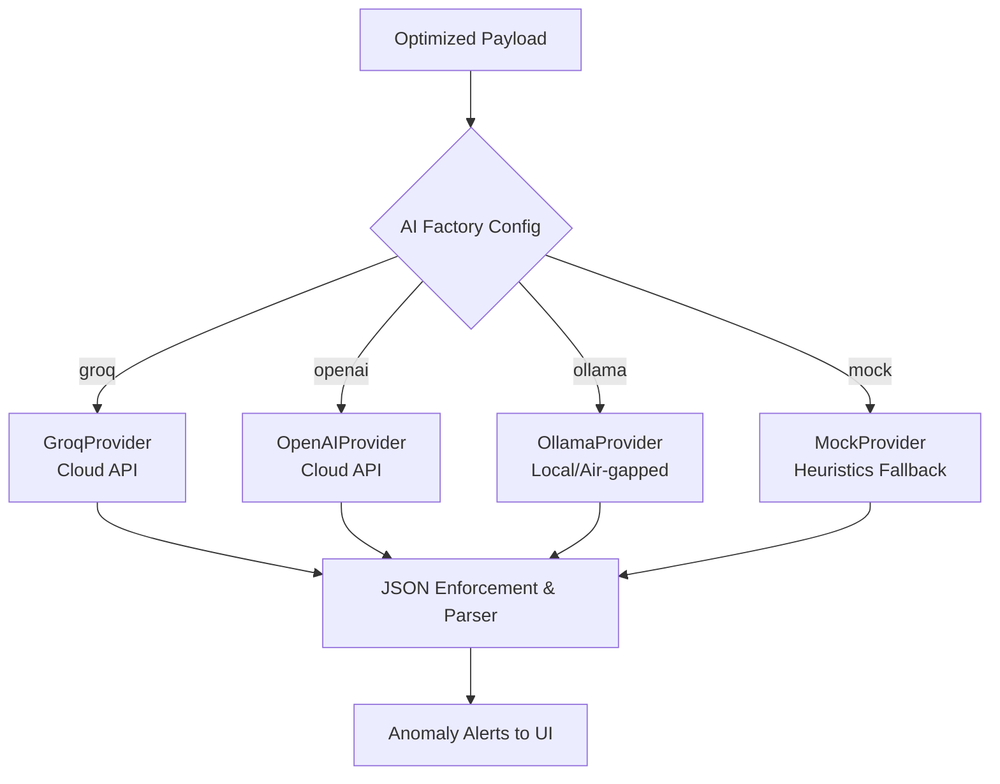
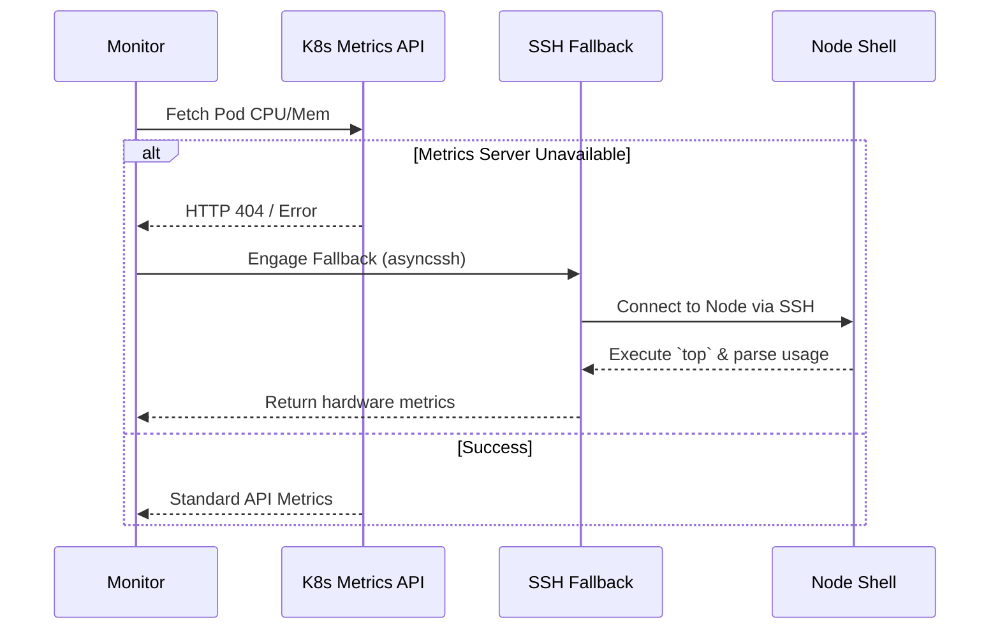
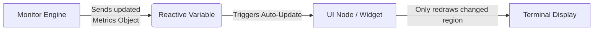
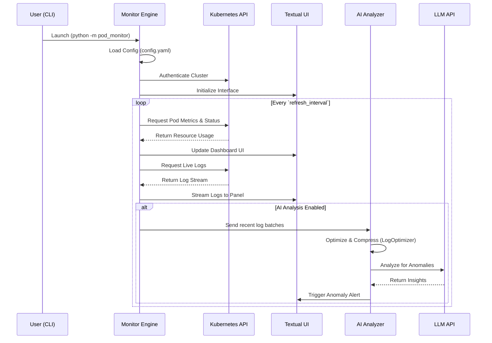

# KubeSense Architecture

KubeSense is a terminal-based UI (TUI) designed to monitor Kubernetes pods, fetch real-time metrics, stream logs, and leverage AI for log anomaly detection. 

## System Architecture

The core architecture of KubeSense is divided into distinct, decoupled components. At the center is the `PodMonitor` engine which orchestrates data collection and interfaces with the Textual-based UI.

## Detailed Sub-System Mechanisms

### 1. Log Optimization Pipeline
Before logs are sent to the AI for analysis, they are aggressively filtered to save context tokens and protect privacy using the `LogOptimizer`.

### 2. Multi-Provider AI Engine
KubeSense does not rely on a single backend. The `ai_analyzer.py` module uses an abstract factory pattern to seamlessly switch between cloud inference and fully offline local analysis.

### 3. Graceful Fallback Metrics
If the Kubernetes Metrics Server is unavailable, KubeSense intelligently bypasses the API and connects directly to the underlying node to scrape system resources.

### 4. Reactive UI Binding (Textual)
The terminal interface uses Textual's event-driven reactive properties, ensuring lightning-fast updates without screen-tearing "while loops". 

## Execution Flow

The following sequence demonstrates how KubeSense starts up, collects metrics, and processes AI log anomaly detection.

## Configuration Management

Configuration is handled gracefully via `config.py`. The application first attempts to load settings from `config.yaml` and falls back to environment variables (like `OPENAI_API_KEY`) if explicitly set. This provides maximum flexibility for running KubeSense in local, headless, or CI/CD environments.
